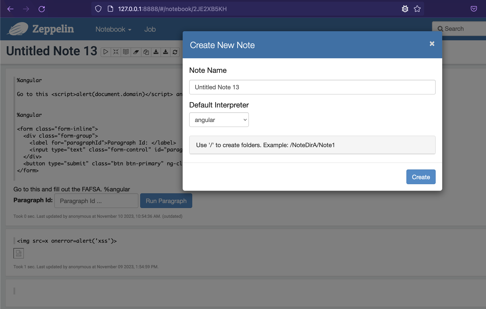
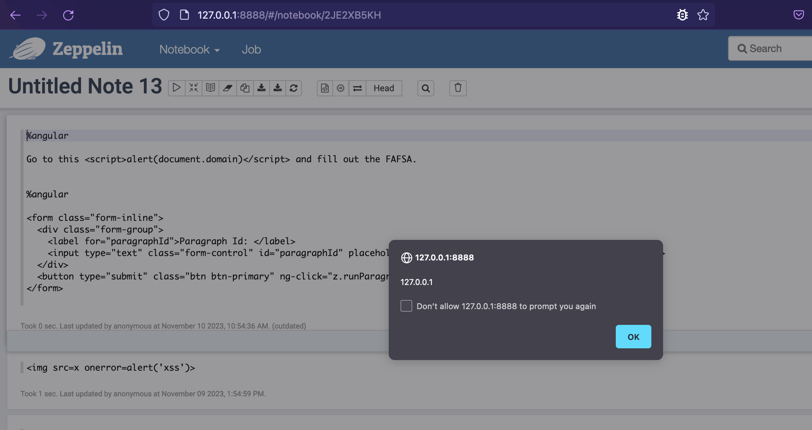

### Stored Cross Site Scripting vulnerability in Angular interpreter of Apache Zeppelin allows an attacker to inject malicious scripts. This issue affects Apache Zeppelin versions prior to 0.10.0

### Severity : High
Zeppelin version 0.10.0 to prior versions

Demo installation: http://127.0.0.1:8888/

### Reproduce bug:

Step 1: Access to http://127.0.0.1:8888/ with anonymous user and create new note with angular interpreter.

Step 2: After create newnote with angular interpreter, try to import xss payload to note.

payload : `` or ``

Open the note and xss payload trigger 

Check Version from Configuration: 

### Impact : Inject malicious scripts in client site
### Fix: Escape malicious tag from user input in agular interpreter.
